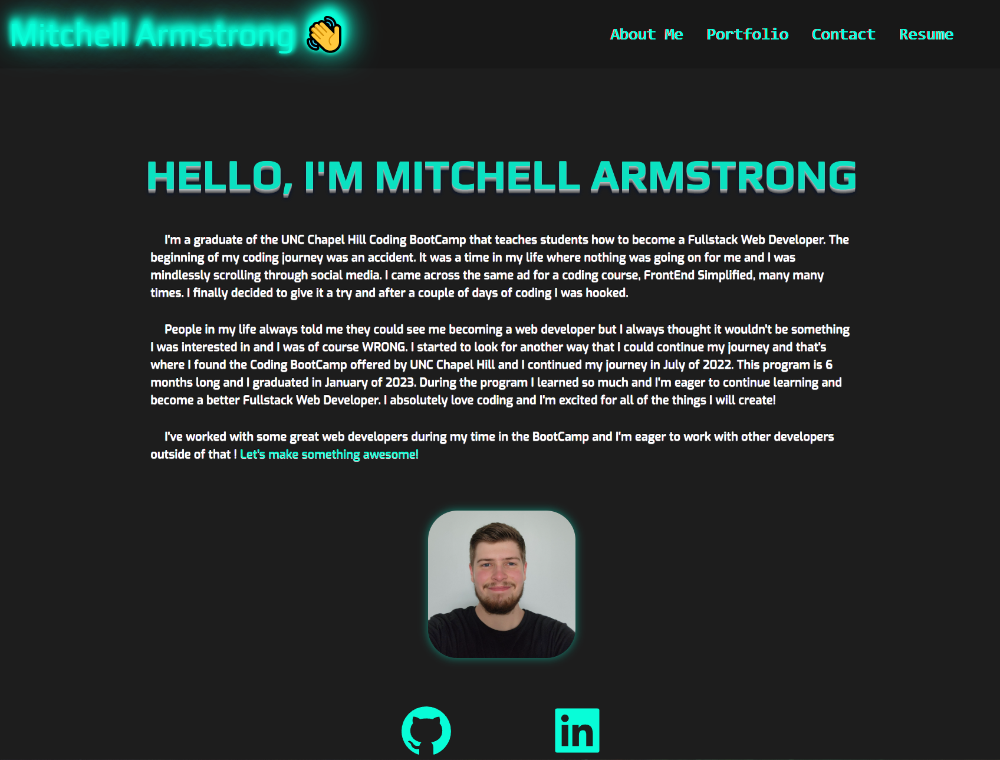
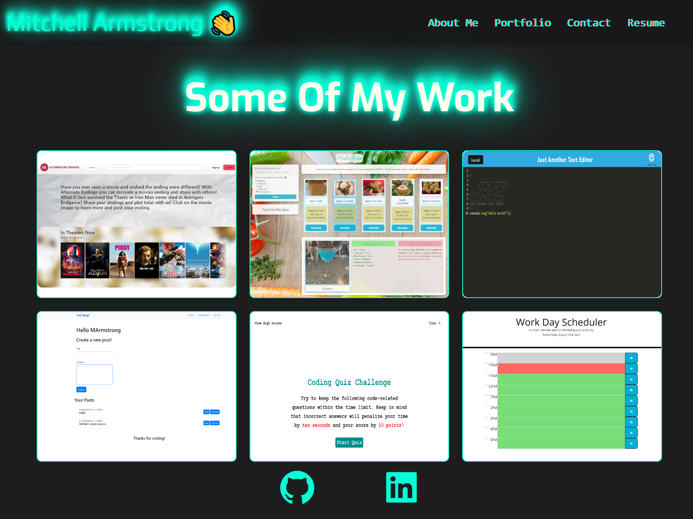
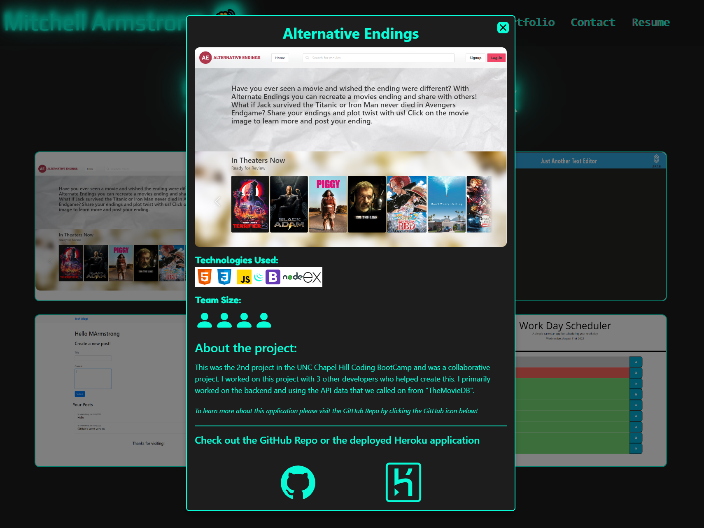
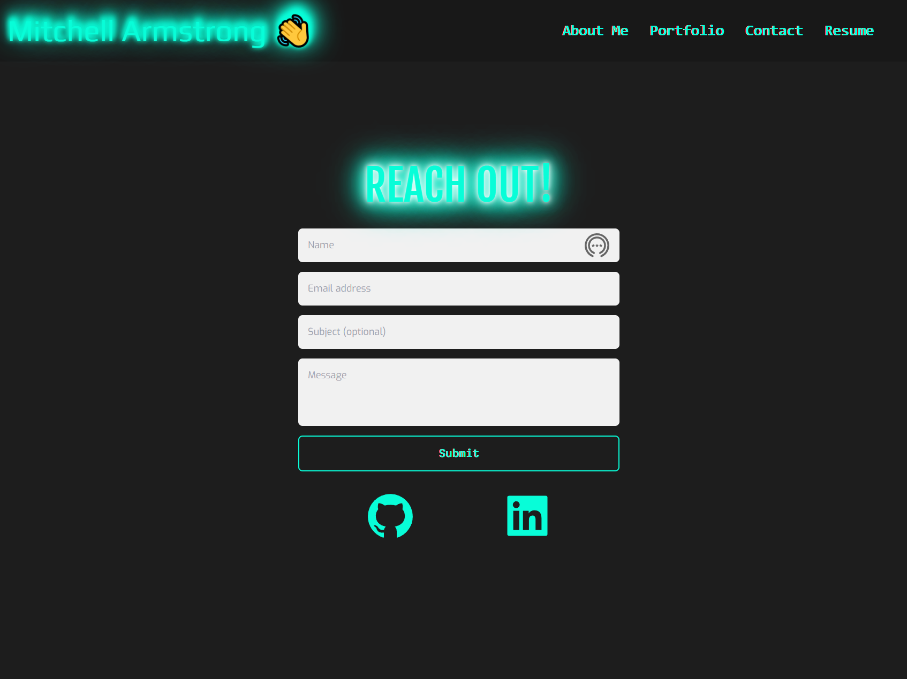
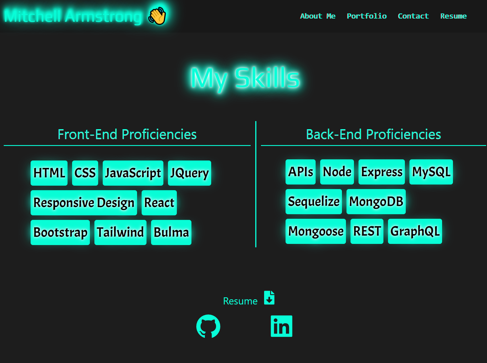

# Mitchell Armstrong's Portfolio

## About the Project
Hello, I'm Mitchell Armstrong! I'm a graduate of the UNC Chapel Hill Coding BootCamp that teaches students how to become a Fullstack Web Developer. I created this portfolio to show off some of my skills as a web developer. This is a React single page application (SPA). In this you will find 4 main components. There is the "About Me" section that acts as the Home Page, a "Portfolio" section that contains some of the projects I have created myself and some that I collaborated on with other web developers, a "Contact" section for you to fill out a contact form that will be emailed to me, and a "Resume" section that lists my skills as a web developer and also includes a way to download my current Resume. I will continue to update this Portfolio with new projects I work on as well as continuing to always improve the website overall. 

## Built With: 

## Here's a preview of the application!
#### About Me (Home Page)

#### Portfolio

#### Portfolio Modal (project selected)

#### Contact

#### Resume

## Here's a link to the Heroku deployment
https://m-armstrong-portfolio.herokuapp.com/

## Here's a link to the GitHub Pages deployment

## Contribution:
Made by Mitchell Armstrong

## Contact
Mitchell Armstrong - mra0211@gmail.com